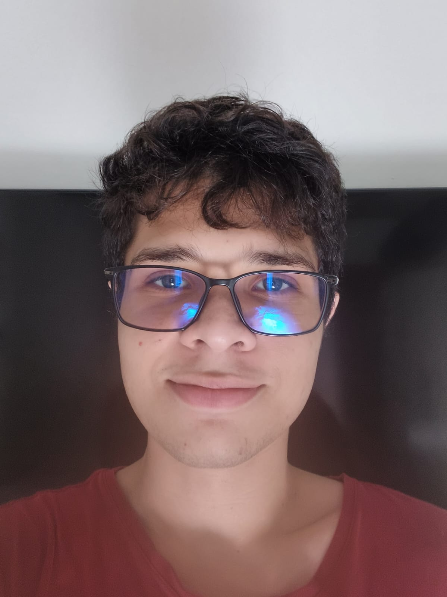

<h1 align="center">
   
 
   
  Eric Freitas Avelino
   
</h1>

  <a href="#english">English</a> •
  <a href="#português">Português</a>

## English

<h3 align="center">
  About me  🖐
</h3>
<h4 align="center">
 I’m a Programmer and Game Designer who have experience working in game development
as both teacher and developer. Also, I've worked in back-end development of multiple APIs.
Currently pursuing my Computer Science Degree, in the 5th semester and looking for game
development job experiences.
</h4>

 
<h3 align="center">
Personal Information
</h3>

  - I enjoy reading and playing videogames as a hobby
  - For the sake of taking care of my body and having fun, i love to go the gym from monday to friday, while practicing my jiu-jitsu sometimes during the week

 
<h3 align="center">
Professional experience
</h3>

  - Back-end Trainee Developer(December 2024 - March 2025): Worked for the technology
solutions company ‘Compass UOL’ on the refactoring, optimizing and maintenance of
various microservices using Java SpringBoot RestFul applications for an automated legal
system, where we provided services to another company called 'VIVO' on an outsourced
basis

  - Game Development teacher(November 2024 - February 2025): I worked at the online
learning platform ‘Kodland’ as a teacher, lecturing kids age 8-9 about Game Development
and about the use of the ‘Roblox Studio’ tool, where we made various gaming projects along
our classes

  - Team Manager and lead Programmer(Ongoing): I’m currently working at a small indie
game studio called ‘2Rios Studio’, located at Manaus, AM, where we develop our main
project, which is a survival horror experience named ‘Mapinguari’, and various other projects
along the years since 2023 in the Unity Engine

  - Back-End Development Intern(April 2024 – September 2024): Worked in “Compass UOL”
as an intern in multiple educational projects as part of their internship program, with the main
projects being: A social networking system based on the old version of Twitter, with profiles,
messaging, and account security integrated with AWS S3; Also, an integrated banking
program with a scoring system.

  - Web Developer(August 2023 - September 2023): Created the website for the consulting
and ESG (Environmental, Social, Governance) firm, Enva.

 
 

## Português

<h3 align="center">
  Sobre mim  🖐
</h3>
<h4 align="center">
 Sou um Programador e Game Designer com experiência em desenvolvimento de jogos, e já atuei
  como professor e como desenvolvedor. Além disso, trabalhei no desenvolvimento
  de back-end de diversas APIs. Atualmente, estou no 5º período de Ciência da Computação
  e estou em busca de oportunidades na área de desenvolvimento de jogos.
</h4>
 
<h3 align="center">
Informação pessoal
</h3>

  - Eu gosto de ler e jogar videogames como hobby
  - Como forma de cuidar do meu corpo e me divertir, eu amo ir para a academia de segunda a sexta, enquanto pratico meu jiu-jitsu algumas vezes durante a semana

 
<h3 align="center">
Experiência profissional
</h3>

  - Desenvolvedor back-end trainee(dezembro de 2024 - março de 2025): Trabalhei para a empresa de soluções de tecnologia 'Compass UOL' na refatoração, otimização e manutenção de vários microsserviços usando aplicações com Java Spring Boot RestFul APIs para um sistema jurídico automatizado, onde fornecemos serviços para outra empresa chamada 'VIVO' em uma base terceirizada
    
  - Professor de desenvolvimento de jogos (novembro de 2024 - fevereiro de 2025): Trabalhei na plataforma de aprendizagem online 'Kodland' como professor, dando aulas para crianças de 8 a 9 anos sobre desenvolvimento de jogos e sobre o uso da ferramenta 'Roblox Studio', onde fizemos vários projetos de jogos ao longo das nossas aulas
    
  - Gerente de equipe e programador principal(em andamento): Atualmente, estou trabalhando em um pequeno estúdio de jogos indie chamado '2Rios Studio', localizado em Manaus, AM, onde desenvolvemos nosso projeto principal, que é uma experiência de survival horror chamada 'Mapinguari', e vários outros projetos ao longo dos anos desde 2023 na Unity Engine
    
  - Desenvolvedor back-end estagiário (abril de 2024 - setembro de 2024): Trabalhei como estagiário na ‘Compass UOL’ em vários projetos educacionais como parte do programa de estágio da empresa, com os principais projetos sendo: Um sistema de rede social baseado na versão antiga do Twitter, com perfis, mensagens e segurança de conta integrados com AWS S3; E. também, Um programa bancário integrado com um sistema de pontuação.
    
  - Desenvolvedor Web (agosto de 2023 - setembro de 2023): Criei o site para a empresa de consultoria e ESG (Ambiental, Social, Governança), Enva.

<h1 align="center">
   
 
   
 Feel free to reach out to me! || Sinta-se livre para entrar em contato!
   
</h1>
